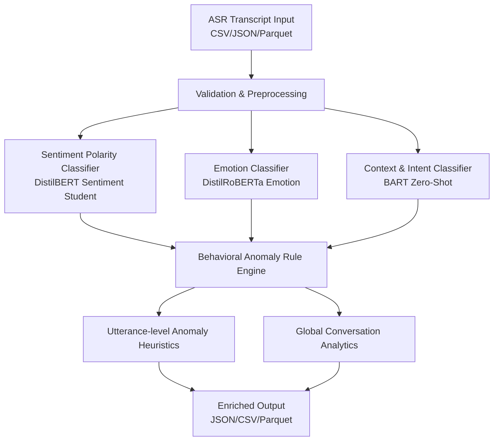

# NLP Behavioral Analysis for ASR Transcripts

[](https://www.python.org/)
[](https://opensource.org/licenses/MIT)
[](https://streamlit.io/)

This repository provides a modular **NLP Behavioral Analysis** pipeline designed for processing ASR/diarization transcript outputs. It enriches audio transcripts with deep learning-derived behavioral insights to support tasks like fraud detection, quality assurance, and deepfake verification.

---

## ⚙️ Architecture & Pipeline Flow

The behavioral analyzer consumes utterance-level transcripts and sequentially routes them through transformer models and a deterministic rules engine:



---

## 📂 Repository Layout

| File / Directory | Description |
| :--- | :--- |
| **`behavioral_analyzer.py`** | Core Python module containing pipeline adapter classes, sentiment/emotion classifiers, and rule-based anomaly engine. |
| **`behavioral_analyzer_cli.py`** | CLI utility for bulk-processing transcripts from files (CSV, JSON, Parquet). |
| **`demo_app.py`** | Streamlit web application providing a premium interactive testing interface with Plotly charts. |
| **`requirements.txt`** | Dependency definitions for execution. |
| **`pyproject.toml`** | Standard metadata and module build configuration for pip. |
| **`LICENSE`** | MIT License terms. |

---

## 🚀 Getting Started

### 1. Installation

Clone this repository, navigate to the folder, create a virtual environment, and install dependencies:

```bash
# Navigate to the workspace
cd /home/isp/Desktop/Sentiment/NLP

# Create and activate virtual environment
python3 -m venv .venv
source .venv/bin/activate

# Upgrade pip and install package in editable mode
python -m pip install --upgrade pip
python -m pip install -r requirements.txt
python -m pip install -e .
```

### 2. Python Quick-Start

Import the analyzer in your code to process transcripts programmatically:

```python
import pandas as pd
from behavioral_analyzer import BehavioralAnalyzer, BehavioralAnalyzerConfig

# Define your diarized utterance inputs
data = [
    {
        "start_time": 0.0,
        "end_time": 4.2,
        "speaker_id": "Agent",
        "transcript": "Hello, banking support line. How may I assist you?"
    },
    {
        "start_time": 5.1,
        "end_time": 12.8,
        "speaker_id": "Caller",
        "transcript": "Please, you must help me! Transfer my funds immediately to a safe account, I am being threatened!"
    }
]
df = pd.DataFrame(data)

# Initialize and execute pipeline
analyzer = BehavioralAnalyzer(BehavioralAnalyzerConfig())
results = analyzer.analyze_dataframe(df)

print(f"Conversation Context: {results['summary']['primary_context']['label']}")
print(f"Global Anomaly Score: {results['summary']['anomaly_metrics']['global_anomaly_score']:.2f}")
```

### 3. Command-Line Utility (CLI)

Run bulk evaluations on data files directly from your terminal:

```bash
# Analyze a JSON transcript and save the results
behavioral-analyzer --input transcript.json --output enriched_output.json --device auto
```

*Supports input/output formats including `.json`, `.jsonl`, `.csv`, and `.parquet`.*

---

## 🖥️ Interactive Web GUI

The Streamlit Web GUI offers a premium testing interface designed to evaluate behavioral metrics in real time. It features responsive, color-coded Plotly charts for sentiment, emotion, and context classification.

To run the web app:

```bash
streamlit run demo_app.py
```

---

## 🛡️ License

This project is licensed under the permissive **MIT License** - see the [LICENSE](file:///home/isp/Desktop/Sentiment/NLP/LICENSE) file for details.
